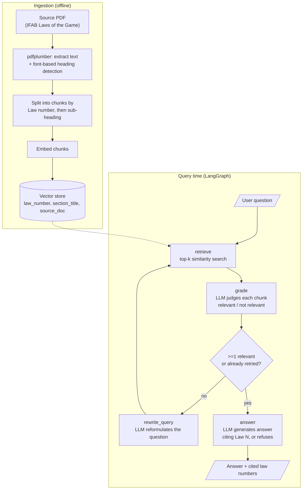

# Soccer Rules RAG

A retrieval-augmented chatbot that answers questions about the IFAB Laws of the Game (soccer/football). It retrieves relevant rule passages, grades them for relevance before answering, cites the specific Law number(s) it used, and says "I don't know" instead of guessing when nothing relevant is found.

**Live demo:** https://soccer-chat-rag.vercel.app
**Eval report:** [eval_report.md](eval_report.md)

## Try it

Ask things like:
- "How many players are on each team?"
- "Is it a handball if the ball hits a natural arm position?"
- "What was the final score of the 2022 World Cup final?" (should refuse — out of scope)

Every answer shows the actual retrieval ranking it used (expand "Retrieval ranking" under the answer), and if it can't answer, it suggests a rephrasing that scores higher against the retriever. You can also switch the **embedding model** (spaCy word vectors vs. a real MiniLM sentence-transformer) per question to see how much retrieval quality alone changes the answer — the LLM stays the same either way, so that's the only variable.

## Architecture



## Run it locally

```bash
git clone https://github.com/daniprado224/soccer_chatbot_rag.git
cd soccer_chatbot_rag
python3.11 -m venv .venv
source .venv/bin/activate
pip install -r requirements.txt
cp .env.example .env
```

Edit `.env` and set an LLM backend — either `LLM_BACKEND=claude` with `ANTHROPIC_API_KEY`, or `LLM_BACKEND=gemini` with a free key from https://aistudio.google.com/apikey. Embeddings default to a local spaCy model (no key needed).

You'll need the IFAB Laws of the Game PDF — download it from https://www.theifab.com/laws-of-the-game-documents/ and place it in `data/raw/`. Then ingest it:

```bash
python -m src.ingestion --pdf "data/raw/<your file>.pdf" --doc-type laws_of_the_game --dump-chunks data/processed/chunks.json
```

For the deployed web app's in-memory store, precompute the embedding matrices too (needed after any change to `chunks.json`):

```bash
python -m scripts.build_embeddings_artifact              # builds both spacy and minilm
```

The `minilm` backend downloads its model from huggingface.co on first run — it needs real network access, which this repo's own dev sandbox didn't have (see "Design choices" below). If that download fails, `embeddings_minilm.npy` just won't exist and the app falls back to spaCy-only, with the minilm toggle disabled.

Query it:

```bash
python -m src.cli "how many players are on a team?"
python -m src.cli                     # interactive
```

Run tests (no API key or PDF required):

```bash
pytest tests/ -v
```

## Repo layout

```
data/
  raw/            # source PDF (gitignored — copyrighted, download it yourself)
  processed/      # chunks.json + embeddings_spacy.npy + embeddings_minilm.npy
  eval/           # ground-truth QA pairs
src/
  ingestion.py    # PDF -> section-aware chunks -> vector store
  embeddings.py   # embedding backends (spacy | minilm | openai)
  llm.py          # LLM backend (claude | gemini)
  graph.py        # LangGraph retrieve/grade/rewrite/answer flow
  memory_vectorstore.py  # in-memory vector store used by the deployed app
  quota_store.py  # shared usage tracker (Upstash Redis) for the deployed app
  query_diagnostics.py   # retrieval ranking + phrasing suggestions
  cli.py, api.py, eval.py
api/query.py      # Vercel serverless function
public/index.html # web frontend
tests/
```

## Evaluation

```bash
python -m src.eval --qa data/eval/qa_pairs.json --top-k 5 --out eval_report.md --json-out eval_results.json

# Compare against the minilm embedding backend (needs embeddings built + network access):
python -m src.eval --embedding-backend minilm --out eval_report_minilm.md --json-out eval_results_minilm.json
```

Retrieval metrics (precision@k / recall@k) are measured before the LLM grader runs, so retrieval quality is scored separately from generation quality. Every failing question is bucketed as `retrieval` (right law never retrieved), `generation` (retrieved but not cited), `over_refusal`, or `hallucination` — see `eval_report.md` for the full per-question breakdown.

26 ground-truth questions: 10 easy factual lookups, 10 ambiguous/edge-case questions, 6 out-of-corpus questions that should be refused.

**Results** (Gemini 3.1 Flash Lite, 144-chunk corpus):

| | n | Precision@k | Recall@k |
|---|---|---|---|
| Retrieval (overall) | 20 | 0.19 | 0.55 |

| | n | Citation overlap | Answerability correct |
|---|---|---|---|
| Generation (overall) | 26 | 0.35 | 0.46 |

- 0 hallucinations — all 6 out-of-corpus questions correctly refused.
- `over_refusal` is the dominant failure mode (14/20 answerable questions). Several of these had the correct chunk in the top-5 retrieval results but the grader still rejected it — pointing at grader strictness, not just weak retrieval, as the main thing to tune next.
- Precision@k of 0.19 reflects the embedding model choice (see below).

**No equivalent numbers for the `minilm` backend yet** — running it needs network access to huggingface.co to download the model, which this repo's own dev sandbox doesn't have (see "Design choices"). The command above will produce them once run somewhere with real network access; until then, don't assume MiniLM is better here, only that it should be — the whole point of shipping both is to let the eval harness (or a user, live in the app) actually settle that instead of taking it on faith.

## Design choices

**Embeddings**: two backends users can compare live in the deployed app: `spacy` (averaged word vectors, no API cost, the original default) and `minilm` (a real sentence-transformer, all-MiniLM-L6-v2, run via `fastembed`/ONNX Runtime rather than the `sentence-transformers` package — that avoids pulling in PyTorch, which alone runs 200-800MB and risks blowing Vercel's serverless function size limit). Averaged word vectors are noticeably weaker than a real sentence embedding model at capturing meaning — this shows up directly in the retrieval numbers above. Both backends share the same in-memory vector-store interface and, in the deployed app, the same LLM — only retrieval changes, so a user switching the toggle is isolating exactly that variable. `minilm` needs network access to huggingface.co on first use to download its model weights; that's not available in this repo's own dev sandbox (same restriction that's always applied to OpenAI's embedding API here), so its numbers above are unmeasured — the code is real and tested with a mocked model, not run end-to-end by this repo's own eval.

**LLM backend**: Claude by default (`LLM_BACKEND=claude`), Gemini as a free alternative (`LLM_BACKEND=gemini`). Anthropic's API has no free tier — Gemini's free tier via Google AI Studio does, at the cost of tighter rate limits (as low as 15 requests/minute on some models) and lower generation quality than Claude. Both backends share one interface (`src/llm.py`), so switching is a one-line env var change; the eval numbers above are specific to whichever backend produced them.

**Deployment**: the web app uses an in-memory vector store instead of the local Chroma index, since Vercel's serverless functions don't have persistent disk. With ~150 chunks this is fast and simple — no hosted vector DB needed. A shared usage tracker (Upstash Redis) shows real-time availability across all visitors, since everyone hits the same free-tier API key. `api/requirements.txt` (scoped separately from the root `requirements.txt`) deliberately omits the `anthropic` SDK — the deployed instance runs `LLM_BACKEND=gemini` exclusively, so bundling Claude's client would be 17MB of dead weight, and adding `fastembed` for the minilm backend pushed the function right up against Vercel's 500MB size limit.

## Known limitations

- Weak retrieval on general/short questions with the `spacy` backend — averaged word vectors reward vocabulary overlap over meaning, so a question phrased differently from the rulebook's own wording can miss the right chunk entirely. The `minilm` backend exists specifically to fix this, but see below.
- The `minilm` backend is real, tested code, but **not validated against the actual model weights** by this repo — huggingface.co is blocked from the dev sandbox this was built in. It needs to be built (`scripts/build_embeddings_artifact.py --backend minilm`) and eval'd somewhere with real network access before its retrieval-quality claims should be trusted, and before relying on it in production. It's also a new failure surface: `fastembed` downloads its model on first use rather than shipping it in the deployed bundle, so a cold Vercel container needs a working connection to huggingface.co (or a pre-populated cache bundled via `vercel.json`'s `includeFiles`) the first time it's asked for — if that's ever unreachable, the toggle correctly reports the backend unavailable rather than crashing, but it does mean one more thing that can be down.
- Only the main Laws of the Game PDF is ingested. The FIFA Disciplinary Code and VAR Protocol are wired into `src/ingestion.py` (`disciplinary_code`, `var_protocol` doc types) but not yet supplied.
- A ~35-page appendix after Law 17 in this edition isn't ingested (no reliable footer/heading marker to segment it by).
