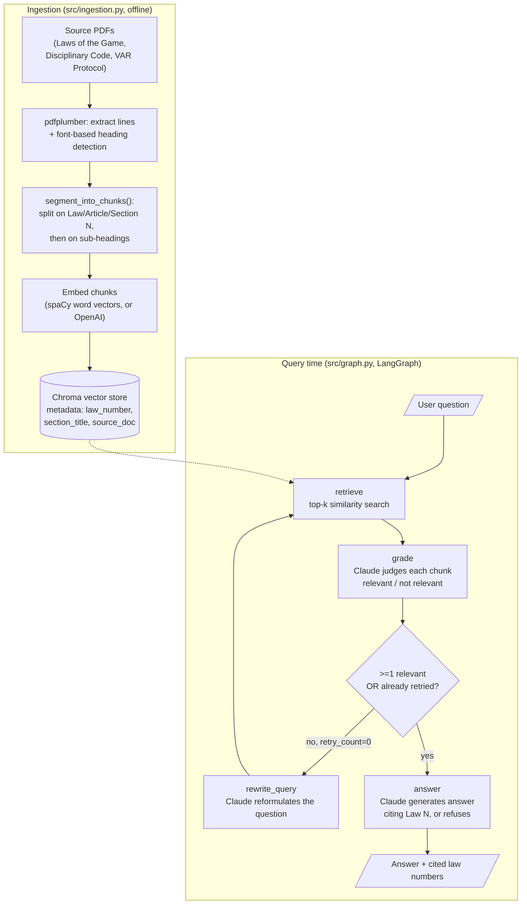

# Soccer Rules RAG

A retrieval-augmented chatbot that answers questions about the IFAB Laws of
the Game (soccer/football), with a LangGraph agent that grades retrieved
passages for relevance and rewrites the query once before giving up, and an
eval harness that reports retrieval and generation accuracy **separately**.

## Status / honesty notes (read this first)

This repo was built in a network-restricted sandbox. Some things that would
normally be "just run it" required explicit tradeoffs — documented here
instead of glossed over:

- **Embeddings backend**: the spec called for OpenAI `text-embedding-3-small`,
  with local-model as a fallback if I wanted to avoid API cost. Neither
  `api.openai.com` nor `huggingface.co` (where most local sentence-embedding
  models live) were reachable from the build sandbox. `github.com` release
  assets were reachable, so the default backend is **spaCy's
  `en_core_web_md`** — averaged 300-dim static word vectors, installed as a
  plain pip wheel with no HF/OpenAI dependency. This is measurably weaker
  than a real sentence-transformer or OpenAI embedding at capturing
  paraphrase/semantic similarity (it has no attention mechanism or
  sentence-level training), which shows up directly in the retrieval
  precision/recall numbers below. `OpenAIEmbeddingsBackend` is implemented
  and wired behind the same interface for when you run this somewhere with
  API access — see [Swapping the embedding backend](#swapping-the-embedding-backend).
- **Generation model**: the spec named `claude-sonnet-4-6`, which is not a
  real model ID. `CLAUDE_MODEL` defaults to `claude-sonnet-5`; change it in
  `.env` to whatever's current when you run this.
- **Source PDFs**: `theifab.com` and `fifa.com` were also blocked from the
  build sandbox, so ingestion could not download them automatically. You
  supply the PDFs (see [Data](#data)).
- **LLM backend for grading/generation**: the spec calls for Claude, and
  that's still the default (`LLM_BACKEND=claude`). But the Anthropic
  Console account this was built against has no credit balance, and its
  free evaluation tier doesn't cover live API calls -- so `src/llm.py`
  also wires in **Gemini** (`LLM_BACKEND=gemini`) as a genuinely free
  alternative (a Google AI Studio key needs no payment method), purely so
  a real eval run was possible at all. This is a real model swap, not an
  infra detail: eval numbers produced under `LLM_BACKEND=gemini` measure
  Gemini's grading/generation quality, not Claude's. The README's eval
  results section says which backend actually produced them.
- **Eval numbers below are only real once you've run `src/eval.py` yourself**
  against the actual Laws of the Game PDF with a working LLM backend
  (either `ANTHROPIC_API_KEY` with Console credits, or a free
  `GEMINI_API_KEY`). Anything still marked "pending" is not a completed
  feature.

## Architecture



## Repo layout

```
data/
  raw/            # source PDFs you provide (gitignored -- copyrighted third-party docs)
  processed/      # optional dumped chunks (--dump-chunks)
  eval/qa_pairs.json  # ground-truth eval set
src/
  ingestion.py    # PDF -> section-aware chunks -> Chroma
  embeddings.py   # pluggable embedding backends (spacy | openai)
  graph.py        # LangGraph retrieve/grade/rewrite/answer state machine
  cli.py          # interactive / one-shot CLI
  api.py          # minimal FastAPI endpoint
  eval.py         # retrieval + generation metrics, markdown report
tests/            # unit tests -- run without any API key or source PDF
```

## Setup

```bash
python3.11 -m venv .venv
source .venv/bin/activate
pip install -r requirements.txt
cp .env.example .env
# edit .env: set ANTHROPIC_API_KEY at minimum
```

`en_core_web_md` is pinned as a direct wheel URL in `requirements.txt`, so
`pip install -r requirements.txt` installs it automatically. If that URL
ever moves, fall back to `python -m spacy download en_core_web_md`.

Run the unit tests (no API key or PDF required — they cover chunking logic,
the LangGraph state machine, and the eval metrics/report with synthetic
fixtures and a mocked Claude client):

```bash
pytest tests/ -v
```

## Data

Place these in `data/raw/` (not tracked in git — see `.gitignore` note):

1. **IFAB Laws of the Game** (current edition), from
   https://www.theifab.com/laws-of-the-game-documents/
2. **FIFA Disciplinary Code** (excerpts or full), from FIFA's publications
3. **VAR Protocol**, from IFAB/FIFA's VAR documentation

Only #1 is required to run the core pipeline; #2 and #3 are the "2-3
supplementary docs" from the spec and are wired into `src/ingestion.py`
via the `disciplinary_code` and `var_protocol` doc profiles, but the two
eval questions that depend on them (`s01`, `s02` in `qa_pairs.json`) are
kept in a separate `supplementary_pending` bucket with `expected_law_numbers:
null` until those documents are actually supplied and ingested — see the
note at the top of that file. Do not treat those two as scored until then.

## Ingestion

```bash
python -m src.ingestion \
  --pdf "data/raw/Laws of the Game 2026_27_double pages.pdf" --doc-type laws_of_the_game \
  --source-doc "IFAB Laws of the Game 2026/27" \
  --pdf data/raw/fifa_disciplinary_code.pdf   --doc-type disciplinary_code \
  --pdf data/raw/var_protocol.pdf             --doc-type var_protocol \
  --dump-chunks data/processed/chunks.json
```

Only the first `--pdf`/`--doc-type` pair has actually been run against a
real document so far (the disciplinary code and VAR protocol PDFs are
still pending — see [Data](#data)). It required two rounds of real tuning
that the synthetic-fixture unit tests couldn't have caught, worth knowing
about if you ingest a different edition or a differently-typeset document:

1. **This PDF is a "double pages" print-spread export**: each physical PDF
   page holds two facing book pages side by side (839×595pt, landscape),
   not one column of text. Grouping words into lines by y-position alone
   (the original approach) interleaved both halves' text into gibberish.
   `_find_column_split` detects the gutter (the widest horizontal word gap
   near the page's midline) and reads left-column-then-right-column
   instead.
2. **Per-Law chapter-opener headings turned out to be rasterized title
   art**, not real text — `pdfplumber` extracts zero words for them, so
   `unit_regex`-based detection (matching a "Law N – Title" text line)
   only ever found 2 of the document's 17 Laws. What *does* repeat
   reliably is IFAB's own running footer, `Laws of the Game 2026/27 | Law
   3 | The Players 61`, present on nearly every content page. `DocProfile.
   footer_regex` + per-page forward-fill (capped at a 4-page gap, since real
   gaps between footer sightings never exceed 2 — see `_footer_law_by_page`)
   uses that instead, and correctly recovered all 17 Laws. `unit_regex`
   is kept as the fallback path for documents where no footer_regex
   matches (e.g. the disciplinary code and VAR protocol, whose real page
   layout isn't known yet).
3. This edition also has a ~35-page "Additional instructions" appendix
   after Law 17 with no footer at all — the gap-capped forward-fill
   correctly stops attributing it to Law 17 rather than mislabeling all of
   it, and it's currently dropped rather than ingested unlabeled. It's
   real IFAB guidance (assistant referee positioning, etc.) that could be
   worth ingesting under its own `doc_type` later; out of scope for now.
4. A handful of near-empty fragments (isolated diagram dimension labels,
   stray bullet glyphs that pick up a heading-styled font) are filtered by
   `MIN_CHUNK_CHARS` rather than kept as junk chunks.

Net result on the real PDF: **144 chunks across all 17 Laws** (see
`data/processed/chunks.json`), each tagged with its real `law_number`,
`law_title`, and `section_title`.

## Querying

```bash
python -m src.cli "how many players are on a team?"
python -m src.cli                     # interactive

uvicorn src.api:app --reload          # POST /query {"question": "..."}
```

## Swapping the embedding backend

Set in `.env`:

```
EMBEDDING_BACKEND=openai
OPENAI_API_KEY=sk-...
```

and `pip install langchain-openai`. Nothing else changes — `graph.py` and
`ingestion.py` only depend on the LangChain `Embeddings` interface. Note:
switching backends means re-running ingestion (embedding spaces aren't
compatible across backends).

## Swapping the LLM backend (grading + generation)

Set in `.env`:

```
LLM_BACKEND=gemini
GEMINI_API_KEY=...   # free at https://aistudio.google.com/apikey
```

or back to `LLM_BACKEND=claude` with `ANTHROPIC_API_KEY` (and Console
credits). Nothing in `graph.py` changes either way — both backends live in
`src/llm.py` behind one `call_llm(system, user, model, max_tokens)`
function. This is the one piece of this repo that deviates from the
original spec's "Claude API" requirement, and only because of a real
constraint (no Console credit balance) rather than preference — see the
[status notes](#status--honesty-notes-read-this-first) at the top.

## Evaluation

```bash
python -m src.eval --qa data/eval/qa_pairs.json --top-k 5 \
  --out eval_report.md --json-out eval_results.json
```

This is the part the spec said matters most, so here's exactly what it
measures and why:

- **Retrieval metrics** (precision@k / recall@k against ground-truth Law
  numbers) are computed from the raw top-k similarity search, *before* the
  relevance grader runs — this isolates embedding/retrieval quality from
  anything the LLM does downstream.
- **Generation metrics** (citation overlap/exact match, answerability
  correctness) are computed from the full graph's final output, *after*
  grading, retry, and generation.
- **Failure attribution**: every question that doesn't fully pass is
  bucketed as `retrieval` (the right law was never in the top-k),
  `generation` (it was retrieved but not cited correctly),
  `over_refusal` (an answerable question got refused), or
  `hallucination` (an out-of-corpus question got answered instead of
  refused) — so you can point at *which stage* broke, not just that the
  final answer was wrong.
- The eval set (`data/eval/qa_pairs.json`) has 26 scored questions: 10 easy
  factual lookups, 10 ambiguous/edge-case interpretation questions
  (handball nuance, offside edge cases, VAR authority limits), and 6
  deliberately out-of-corpus questions to test refusal instead of
  hallucination. 2 more are pending supplementary-doc ingestion (see
  [Data](#data)).

### Results

**Not yet run.** This requires the real Laws of the Game PDF (in progress —
being supplied separately) and a valid `ANTHROPIC_API_KEY`. Run the command
above and paste the generated `eval_report.md` contents here — do not fill
in numbers by hand. `git diff` after a real run will show exactly the
table below being replaced with actual measured precision@k, recall@k,
citation accuracy, and the failure-mode breakdown.

<!-- EVAL_REPORT_START -->
_pending real ingestion + eval run_
<!-- EVAL_REPORT_END -->

## Known limitations

- spaCy averaged-word-vector embeddings will noticeably underperform a real
  sentence embedding model on paraphrased or compositional questions (e.g.
  "the guy who came off the bench" vs "substitute"). This isn't theoretical:
  a manual spot check against the real ingested corpus already shows it —
  a query for "where is a corner kick taken from?" doesn't return the
  correct Law 17 chunk in its top 3 at all, even though that chunk exists
  and clearly answers the question. The eval report's retrieval
  precision/recall numbers (once a real eval run happens) will quantify
  this properly instead of one spot check.
- Chapter-opener "Law N" headings in the real PDF are rasterized title art
  with no extractable text (see [Ingestion](#ingestion)), so law-boundary
  detection is driven by IFAB's running footer text, not an in-body
  heading. This is specific to this document/edition's typesetting — a
  different edition or the disciplinary code/VAR protocol PDFs may not
  have an equivalent footer, in which case ingestion falls back to the
  original heading-based `unit_regex` detection, which is unverified
  against a real document of that kind yet.
- The ~35-page appendix after Law 17 in this edition is currently dropped
  entirely rather than ingested (see [Ingestion](#ingestion)) — questions
  whose answer lives only in that appendix will correctly get "I don't
  know," but that's a corpus gap, not a retrieval or generation failure,
  and isn't distinguished as such in the failure-attribution buckets.
- The relevance grader and query rewriter are themselves LLM calls, so
  their own error rate (mis-grading a relevant chunk as irrelevant, or a
  bad rewrite) is a source of noise in the generation metrics that this
  eval harness attributes to "generation," not "retrieval" — that's a
  modeling choice, not a hidden bug.
